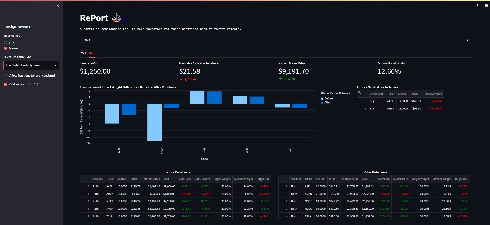

# **RePort** ⚖️
A portfolio rebalancing tool to help investors get their positions back to target weights. Powered by [DuckDB](https://duckdb.org/) & [Streamlit](https://streamlit.io/).

## **Overview**
RePort is designed to help investors get their positions back to their target weights. RePort has 3 different types of rebalance methods.

1. **Investable Cash Dynamic**
    
    Investable cash dynamic will only invest the cash you have in your account, meaning it will only create buy orders for underweight positions and **no** sell orders for overweight positions. This method will proportionally invest money into the positions that are the most underweight. It will also will invest the cash until no more shares can be purchased. 
    
    This rebalance technique was inspired by M1 Finance's [Dynamic Rebalancing](https://help.m1.com/hc/en-us/articles/4404766862739-Rebalancing-#h_01FC8VVBDJCZ69HE40QK817GWK).

2. **Investable Cash Target**

    This method will invest the cash according to the target weight for that security.

3. **Whole Portfolio**

    This method will rebalance the entire portfolio by creating sell orders for overweight positions and buy orders for underweight positions.

## **Configurations**
- **Input Method**
    - **File**: Can upload a csv file with holdings. Take a look at the [examples](https://github.com/TylerHillery/RePort/tree/main/app/data) on the format expected for the csv files. 
    - **Manual**: Can edit an editable DataFrame similar to an spreadsheet
- **Allow Fractional Shares**
    - This will impact the calculations for the rebalance by allowing the ability to purchase fractional shares.
- **Add Sample Data** 
    - Will delete all current data and load sample data to show how the app can be used. 

## **Disclaimer**
This app does not store any data. After the streamlit sessions ends your data will be lost. The easiest way to get the data to persist would be to clone this repo and instead of using the `:memory:` connection you can create a duckdb database file. 

The tool is for informational purposes only, you should not construe any such information or other material as legal, tax, investment, financial, or other advice.

## **Future Work**
- [ ] CI/CD
    - [ ] Show Streamlit preview in PR 
    - [ ] Map Volumes for Docker File
- [ ] Tests
- [ ] Connect to brokerage account
- [ ] Clean up `database.py` to something like [DuckPond](https://github.com/petehunt/dagster-poor-mans-data-lake/blob/main/jaffle/duckpond.py)
- [ ] Add dev container
